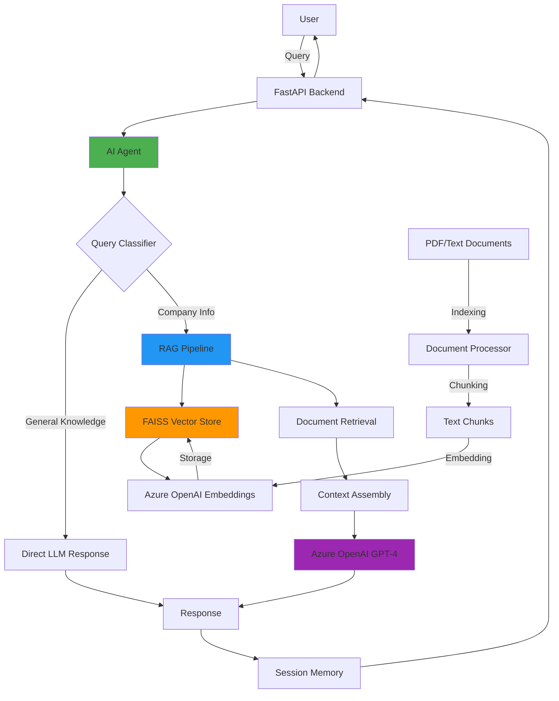

# RAG-based AI Agent System

A production-ready RAG (Retrieval-Augmented Generation) AI Agent that intelligently decides whether to answer user queries directly or retrieve information from a document knowledge base. Built with FastAPI and Azure OpenAI, deployed on Azure App Service.

[](https://www.python.org/downloads/)
[](https://fastapi.tiangolo.com/)
[](https://opensource.org/licenses/MIT)

## 📋 Table of Contents

- [Architecture Overview](#️-architecture-overview)
- [Tech Stack](#️-tech-stack)
- [Features](#-features)
- [Local Setup](#-local-setup)
- [Azure Deployment](#️-azure-deployment)
- [API Documentation](#-api-documentation)
- [Design Decisions](#-design-decisions)
- [Limitations & Future Improvements](#️-limitations--future-improvements)

---

## 🏗️ Architecture Overview



### Component Flow

1. **User Query** → FastAPI receives query via `/api/v1/ask` endpoint
2. **Query Classification** → AI Agent determines if query needs RAG or direct answer
3. **RAG Pipeline** (if needed):
   - Search vector store for relevant documents
   - Retrieve top-k similar chunks
   - Assemble context from retrieved documents
4. **Response Generation** → Azure OpenAI generates response (with or without context)
5. **Session Management** → Conversation history stored for context continuity
6. **Response Delivery** → JSON response with answer, sources, and metadata

---

## 🛠️ Tech Stack

### Core Technologies
- **Python 3.11+** - Primary programming language
- **FastAPI** - High-performance web framework
- **Azure OpenAI** - LLM and embeddings (GPT-4, text-embedding-ada-002)
- **LangChain** - Agent orchestration and document processing
- **FAISS** - Vector similarity search (local development)
- **Azure AI Search** - Vector store (production, optional)

### Key Libraries
- **Pydantic** - Data validation and settings management
- **PyPDF2 / pdfplumber** - PDF document processing
- **Uvicorn** - ASGI server
- **Docker** - Containerization
- **Azure SDK** - Azure service integration

### Infrastructure
- **Azure App Service** - Application hosting
- **Azure Container Registry** - Docker image storage
- **Azure OpenAI Service** - LLM and embeddings API
- **Azure Key Vault** - Secrets management (optional)

---

## ✨ Features

### Core Functionality
- ✅ **Intelligent Query Routing** - Automatically classifies queries as general knowledge or document-specific
- ✅ **RAG Implementation** - Retrieves relevant document chunks for context-aware responses
- ✅ **Tool Calling** - Document search tool with semantic similarity
- ✅ **Session Memory** - Maintains conversation context across multiple queries
- ✅ **Source Attribution** - Returns source documents used in responses

### API Features
- ✅ **RESTful API** - Clean, well-documented endpoints
- ✅ **Request Validation** - Pydantic models for type safety
- ✅ **Health Checks** - Monitoring endpoint for service status
- ✅ **CORS Support** - Cross-origin resource sharing enabled
- ✅ **Error Handling** - Comprehensive error responses

### Security & Production
- ✅ **Environment Variables** - Secure configuration management
- ✅ **Docker Support** - Containerized deployment
- ✅ **Azure Integration** - Native Azure OpenAI and App Service support
- ✅ **Logging** - Structured logging for debugging and monitoring
- ✅ **Rate Limiting Ready** - Prepared for rate limiting implementation

---

## 🚀 Local Setup

### Prerequisites

- Python 3.11 or higher
- Azure OpenAI API access (API key and endpoint)
- Git
- Docker (optional, for containerized deployment)

### Step 1: Clone Repository

```bash
git clone <repository-url>
cd rag-ai-agent
```

### Step 2: Create Virtual Environment

```bash
# Windows
python -m venv venv
venv\Scripts\activate

# Linux/Mac
python3 -m venv venv
source venv/bin/activate
```

### Step 3: Install Dependencies

```bash
pip install -r requirements.txt
```

### Step 4: Configure Environment Variables

Create a `.env` file in the root directory:

```bash
cp .env.example .env
```

Edit `.env` and add your Azure OpenAI credentials:

```env
AZURE_OPENAI_API_KEY=your_api_key_here
AZURE_OPENAI_ENDPOINT=https://your-resource.openai.azure.com/
AZURE_OPENAI_DEPLOYMENT_NAME=gpt-4
AZURE_OPENAI_EMBEDDING_DEPLOYMENT=text-embedding-ada-002
AZURE_OPENAI_API_VERSION=2024-02-15-preview

VECTOR_STORE_TYPE=faiss
LOG_LEVEL=INFO
```

### Step 5: Add Documents

Place your PDF or TXT documents in the `documents/` directory. The system includes 5 sample documents:
- `hr_policies.txt` - Company HR policies
- `product_faq.txt` - Product FAQs
- `security_policies.txt` - IT security policies
- `onboarding_guide.txt` - Employee onboarding
- `api_documentation.txt` - API documentation

### Step 6: Initialize System

Run the setup script to process documents and create the vector store:

```bash
python setup.py
```

This will:
- Verify environment configuration
- Create necessary directories
- Process and chunk documents
- Generate embeddings
- Build FAISS vector index
- Save vector store to disk

### Step 7: Start the Application

```bash
# Development mode with auto-reload
uvicorn app.main:app --reload --host 0.0.0.0 --port 8000

# Or use the main module
python -m app.main
```

The API will be available at:
- **API**: http://localhost:8000
- **Interactive Docs**: http://localhost:8000/docs
- **Alternative Docs**: http://localhost:8000/redoc

### Step 8: Test the API

Using curl:

```bash
# Test health endpoint
curl http://localhost:8000/api/v1/health

# Ask a question
curl -X POST http://localhost:8000/api/v1/ask \
  -H "Content-Type: application/json" \
  -d '{"query": "What is the company leave policy?"}'

# General knowledge question
curl -X POST http://localhost:8000/api/v1/ask \
  -H "Content-Type: application/json" \
  -d '{"query": "What is the capital of France?"}'
```

Using Python:

```python
import requests

response = requests.post(
    "http://localhost:8000/api/v1/ask",
    json={"query": "What is the company leave policy?"}
)

print(response.json())
```

---

## ☁️ Azure Deployment

### Prerequisites

- Azure subscription
- Azure CLI installed
- Docker installed
- Azure OpenAI resource created

### Option 1: Automated Deployment Script

```bash
cd deployment
chmod +x azure-deploy.sh
./azure-deploy.sh
```

The script will:
1. Login to Azure
2. Create resource group
3. Create Azure Container Registry
4. Build and push Docker image
5. Create App Service Plan
6. Create Web App
7. Configure environment variables
8. Set up health checks
9. Deploy the application

### Option 2: Manual Deployment

#### 1. Create Azure Resources

```bash
# Set variables
RESOURCE_GROUP="rag-ai-agent-rg"
LOCATION="eastus"
APP_SERVICE_PLAN="rag-ai-agent-plan"
WEB_APP_NAME="rag-ai-agent-app"
CONTAINER_REGISTRY="ragaiagentacr"

# Create resource group
az group create --name $RESOURCE_GROUP --location $LOCATION

# Create container registry
az acr create \
  --resource-group $RESOURCE_GROUP \
  --name $CONTAINER_REGISTRY \
  --sku Basic \
  --admin-enabled true

# Create App Service plan
az appservice plan create \
  --name $APP_SERVICE_PLAN \
  --resource-group $RESOURCE_GROUP \
  --is-linux \
  --sku B1
```

#### 2. Build and Push Docker Image

```bash
# Login to ACR
az acr login --name $CONTAINER_REGISTRY

# Build image
docker build -t rag-ai-agent:latest -f deployment/Dockerfile .

# Tag and push
ACR_LOGIN_SERVER=$(az acr show --name $CONTAINER_REGISTRY --query loginServer --output tsv)
docker tag rag-ai-agent:latest $ACR_LOGIN_SERVER/rag-ai-agent:latest
docker push $ACR_LOGIN_SERVER/rag-ai-agent:latest
```

#### 3. Create and Configure Web App

```bash
# Create web app
az webapp create \
  --resource-group $RESOURCE_GROUP \
  --plan $APP_SERVICE_PLAN \
  --name $WEB_APP_NAME \
  --deployment-container-image-name $ACR_LOGIN_SERVER/rag-ai-agent:latest

# Configure environment variables
az webapp config appsettings set \
  --resource-group $RESOURCE_GROUP \
  --name $WEB_APP_NAME \
  --settings \
    AZURE_OPENAI_API_KEY="your_key" \
    AZURE_OPENAI_ENDPOINT="your_endpoint" \
    AZURE_OPENAI_DEPLOYMENT_NAME="gpt-4" \
    AZURE_OPENAI_EMBEDDING_DEPLOYMENT="text-embedding-ada-002" \
    WEBSITES_PORT="8000"

# Configure health check
az webapp config set \
  --resource-group $RESOURCE_GROUP \
  --name $WEB_APP_NAME \
  --health-check-path "/api/v1/health"
```

#### 4. Verify Deployment

```bash
# Get app URL
az webapp show --resource-group $RESOURCE_GROUP --name $WEB_APP_NAME --query defaultHostName --output tsv

# Test health endpoint
curl https://your-app.azurewebsites.net/api/v1/health
```

### Using Docker Compose (Local Testing)

```bash
cd deployment
docker-compose up --build
```

---

## 📚 API Documentation

### Base URL

- **Local**: `http://localhost:8000/api/v1`
- **Azure**: `https://your-app.azurewebsites.net/api/v1`

### Endpoints

#### POST /ask

Process a user query and return an AI-generated response.

**Request:**
```json
{
  "query": "What is the company's leave policy?",
  "session_id": "optional-session-id"
}
```

**Response:**
```json
{
  "answer": "According to company policy, employees are entitled to 15-25 days of paid leave per year based on tenure...",
  "source": ["hr_policies.txt"],
  "session_id": "abc-123-def",
  "metadata": {
    "classification": "DOCUMENT",
    "used_rag": true,
    "num_sources": 1
  }
}
```

#### GET /health

Health check endpoint.

**Response:**
```json
{
  "status": "healthy",
  "version": "1.0.0",
  "vector_store_stats": {
    "total_documents": 150,
    "index_size": 150,
    "dimension": 1536
  }
}
```

#### GET /documents

List all documents in the knowledge base.

**Response:**
```json
{
  "documents": [
    {
      "name": "hr_policies.txt",
      "path": "documents/hr_policies.txt",
      "type": "txt"
    }
  ],
  "total_count": 5
}
```

#### POST /reset-session

Reset a conversation session.

**Request:**
```json
{
  "session_id": "abc-123-def"
}
```

For complete API documentation, visit `/docs` when the application is running.

---

## 🎯 Design Decisions

### 1. Query Classification Approach

**Decision**: Use LLM-based classification instead of keyword matching

**Rationale**:
- More flexible and context-aware
- Handles ambiguous queries better
- Adapts to conversational context
- Reduces false positives/negatives

**Trade-off**: Slightly higher latency and API costs

### 2. Vector Store Selection

**Decision**: FAISS for local/development, Azure AI Search for production

**Rationale**:
- FAISS: Fast, no external dependencies, perfect for development
- Azure AI Search: Managed service, scalable, integrated with Azure ecosystem
- Easy migration path between the two

**Alternative Considered**: Pinecone (excellent but adds external dependency)

### 3. Chunking Strategy

**Decision**: RecursiveCharacterTextSplitter with 1000 char chunks, 200 overlap

**Rationale**:
- Balances context preservation with retrieval precision
- 200-char overlap ensures continuity across chunks
- Recursive splitting respects document structure

**Parameters**:
- Chunk size: 1000 characters
- Overlap: 200 characters
- Separators: Paragraphs, sentences, words

### 4. Session Memory Implementation

**Decision**: In-memory session store with timeout

**Rationale**:
- Simple and fast for MVP
- No external dependencies
- Automatic cleanup of expired sessions
- Easy to migrate to Redis for production

**Production Path**: Replace with Redis for distributed deployment

### 5. Embedding Model

**Decision**: text-embedding-ada-002

**Rationale**:
- Industry standard for semantic search
- 1536 dimensions - good balance of quality and performance
- Cost-effective
- Native Azure OpenAI support

### 6. Response Generation

**Decision**: GPT-4 for both classification and response generation

**Rationale**:
- Superior reasoning for query classification
- High-quality, coherent responses
- Better context understanding
- Can use GPT-3.5-turbo for cost optimization if needed

---

## ⚠️ Limitations & Future Improvements

### Current Limitations

1. **Session Memory**
   - In-memory storage (not distributed)
   - Lost on application restart
   - Not suitable for multi-instance deployment

2. **Vector Store**
   - FAISS is local (not shared across instances)
   - No real-time document updates
   - Requires rebuild for new documents

3. **Scalability**
   - Single-instance deployment
   - No load balancing
   - No caching layer

4. **Document Processing**
   - Limited to PDF and TXT files
   - No support for Word, Excel, PowerPoint
   - No OCR for scanned documents

5. **Security**
   - Basic authentication only
   - No user-level access control
   - No audit logging

### Future Improvements

#### Short-term (1-3 months)

- [ ] **Redis Integration** - Distributed session storage
- [ ] **Azure AI Search** - Production vector store
- [ ] **Document Upload API** - Dynamic document management
- [ ] **Caching Layer** - Redis cache for frequent queries
- [ ] **Rate Limiting** - API rate limiting per user/IP
- [ ] **Monitoring** - Azure Application Insights integration
- [ ] **Authentication** - API key or OAuth 2.0

#### Medium-term (3-6 months)

- [ ] **Multi-format Support** - Word, Excel, PowerPoint, HTML
- [ ] **Advanced Chunking** - Semantic chunking, table extraction
- [ ] **Hybrid Search** - Combine keyword and semantic search
- [ ] **Query Rewriting** - Improve retrieval with query expansion
- [ ] **Multi-language Support** - Internationalization
- [ ] **Streaming Responses** - Server-sent events for real-time responses
- [ ] **Conversation Analytics** - Usage metrics and insights

#### Long-term (6-12 months)

- [ ] **Fine-tuned Models** - Custom embeddings for domain-specific data
- [ ] **Multi-modal RAG** - Support images, charts, diagrams
- [ ] **Advanced Agents** - Multi-tool agents with web search, calculations
- [ ] **Knowledge Graph** - Structured knowledge representation
- [ ] **Feedback Loop** - User feedback for continuous improvement
- [ ] **A/B Testing** - Experiment with different retrieval strategies
- [ ] **Enterprise Features** - SSO, RBAC, compliance reporting

---

## 📝 License

This project is licensed under the MIT License.

---

## 🤝 Contributing

Contributions are welcome! Please feel free to submit a Pull Request.

---

## 🙏 Acknowledgments

- Azure OpenAI for LLM and embeddings
- FastAPI for the excellent web framework
- LangChain for RAG utilities
- FAISS for vector similarity search

---
